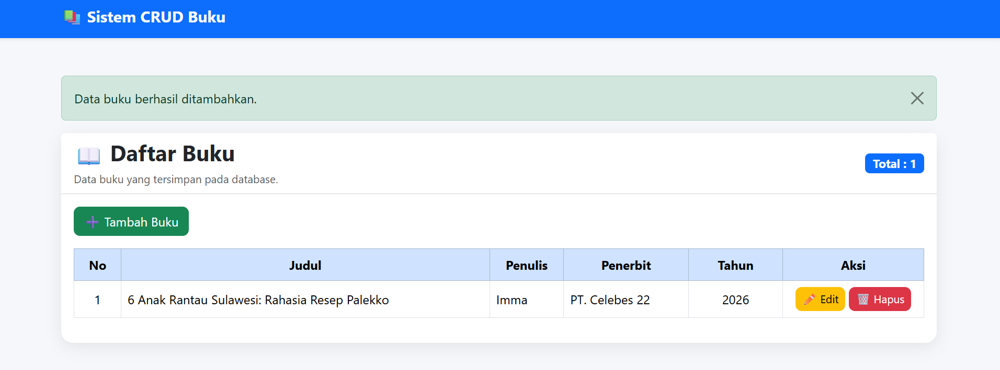
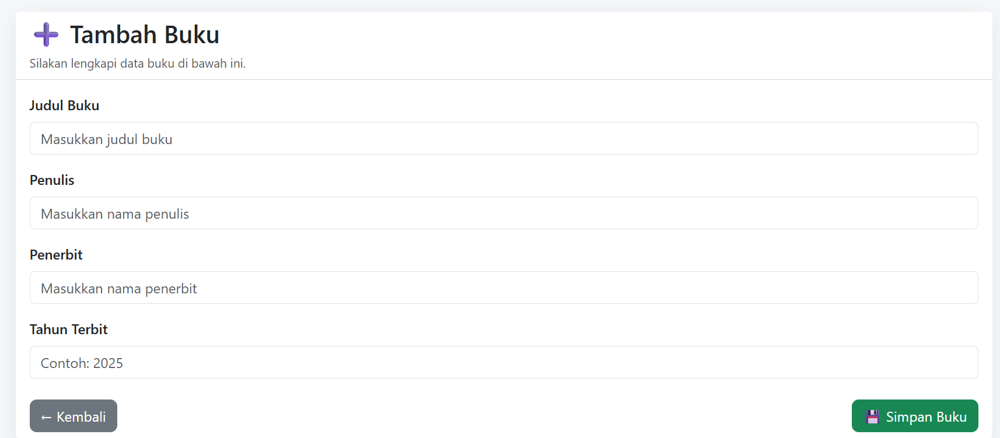
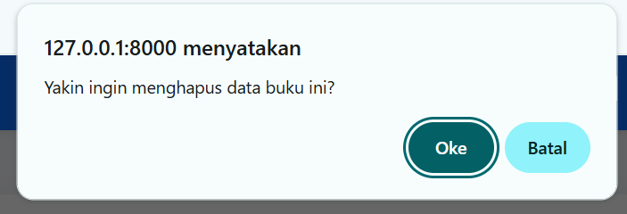
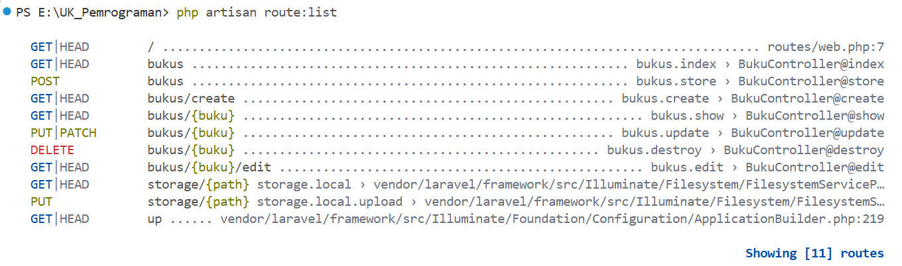

# 📚 Sistem CRUD Buku Laravel

## Deskripsi Project

Project ini merupakan aplikasi **CRUD (Create, Read, Update, Delete)** sederhana yang dibangun menggunakan **Laravel** dengan menerapkan konsep **Model-View-Controller (MVC)**.

Project ini dibuat sebagai tugas **Ujian Khusus Pemrograman Website** dengan memanfaatkan **Artificial Intelligence (AI)** sebagai asisten dalam proses pengembangan aplikasi.

---

# Fitur Aplikasi

Aplikasi memiliki fitur sebagai berikut:

- ✅ Menampilkan daftar buku
- ✅ Menambahkan data buku
- ✅ Mengubah data buku
- ✅ Menghapus data buku
- ✅ Validasi input
- ✅ Menggunakan Bootstrap untuk antarmuka
- ✅ Menggunakan MySQL sebagai database

---

# Teknologi yang Digunakan

- Laravel
- PHP 8.2
- MySQL
- Bootstrap 5
- Composer
- Git
- GitHub

---

# Struktur MVC

Project menerapkan konsep MVC (Model-View-Controller):

Model

- Buku.php

Controller

- BukuController.php

View

- index.blade.php
- create.blade.php
- edit.blade.php

Routing

- routes/web.php

---

# Cara Menjalankan Project

## 1. Clone Repository

```bash
git clone https://github.com/USERNAME/UK_Pemrograman.git
```

## 2. Masuk ke Folder Project

```bash
cd UK_Pemrograman
```

## 3. Install Dependency

```bash
composer install
```

## 4. Copy File Environment

```bash
cp .env.example .env
```

atau pada Windows:

```bash
copy .env.example .env
```

---

## 5. Generate Application Key

```bash
php artisan key:generate
```

---

## 6. Konfigurasi Database

Edit file `.env`

```env
DB_CONNECTION=mysql
DB_HOST=127.0.0.1
DB_PORT=3306
DB_DATABASE=crud_buku
DB_USERNAME=root
DB_PASSWORD=
```

---

## 7. Jalankan Migration

```bash
php artisan migrate
```

---

## 8. Menjalankan Project

```bash
php artisan serve
```

Kemudian buka browser:

```
http://127.0.0.1:8000/bukus
```

---

# Pengujian CRUD

Aplikasi telah berhasil diuji dengan skenario berikut:

- Menampilkan data buku
- Menambahkan data buku
- Mengubah data buku
- Menghapus data buku

Semua fitur berjalan dengan baik.

---

# Screenshot

# Dokumentasi dan Screenshot

## 1. Halaman Dashboard

Halaman utama aplikasi CRUD Buku setelah berhasil dijalankan menggunakan Laravel.


---

## 2. Halaman Daftar Buku

Halaman ini menampilkan seluruh data buku yang tersimpan pada database. Pengguna dapat menambah, mengubah, maupun menghapus data buku.



---

## 3. Form Tambah Buku

Halaman ini digunakan untuk menambahkan data buku baru ke dalam database.



---

## 4. Form Edit Buku

Halaman ini digunakan untuk memperbarui data buku yang telah tersimpan.


---

## 5. Konfirmasi Hapus Buku

Sebelum data dihapus, sistem menampilkan dialog konfirmasi agar pengguna tidak menghapus data secara tidak sengaja.



---

## 6. Daftar Routing Laravel

Berikut merupakan daftar route yang dihasilkan menggunakan perintah:

```bash
php artisan route:list
```

Route tersebut menunjukkan implementasi Resource Controller untuk operasi CRUD.



# Prompt AI

Berikut contoh prompt yang digunakan selama proses pengembangan aplikasi:

> Bertindaklah sebagai Senior Software Engineer dan Dosen Senior Laravel. Bimbing saya membuat aplikasi CRUD Buku menggunakan Laravel dengan konsep MVC secara bertahap mulai dari konfigurasi project, database, migration, model, controller, routing, view, hingga CRUD lengkap. Jelaskan setiap langkah, alasan penggunaan kode, serta best practice Laravel.

AI yang digunakan:

- ChatGPT

---

# Author

Nama : Muhammad Farhan

Repository dibuat sebagai tugas Ujian Khusus Pemrograman Website.